# Orthogonal Projection Loss (ICCV'21)
[Kanchana Ranasinghe](https://scholar.google.com/citations?user=K2WBZTwAAAAJ),
[Muzammal Naseer](https://scholar.google.ch/citations?user=tM9xKA8AAAAJ&hl=en),
[Munawar Hayat](https://scholar.google.ch/citations?user=Mx8MbWYAAAAJ&hl=en&oi=ao), 
[Salman Khan](https://scholar.google.com/citations?user=M59O9lkAAAAJ&hl=en), &
[Fahad Shahbaz Khan](https://scholar.google.ch/citations?user=zvaeYnUAAAAJ&hl=en&oi=ao)

**[Paper Link](https://arxiv.org/abs/2103.14021)** 

> **Abstract:** 
>*Deep neural networks have achieved remarkable performance on a range of classification tasks, with softmax cross-entropy (CE) loss emerging as the de-facto objective function. The CE loss encourages features of a class to have a higher projection score on the true class-vector compared to the negative classes. However, this is a relative constraint and does not explicitly force different class features to be well-separated. Motivated by the observation that ground-truth class representations in CE loss are orthogonal (one-hot encoded vectors), we develop a novel loss function termed “Orthogonal Projection Loss” (OPL) which imposes orthogonality in the feature space. OPL augments the properties of CE loss and directly enforces inter-class separation alongside intra-class clustering in the feature space through orthogonality constraints on the mini-batch level. As compared to other alternatives of CE, OPL offers unique advantages e.g., no additional learnable parameters, does not require careful negative mining and is not sensitive to the batch size. Given the plug-and-play nature of OPL, we evaluate it on a diverse range of tasks including image recognition (CIFAR-100), large-scale classification (ImageNet), domain generalization (PACS) and few-shot learning (miniImageNet, CIFAR-FS, tiered-ImageNet and Meta-dataset) and demonstrate its effectiveness across the board. Furthermore, OPL offers better robustness against practical nuisances such as adversarial attacks and label noise.* 

## Citation

```bibtex
@article{kanchana2021orthogonal,
  title={Orthogonal Projection Loss},
  author={Ranasinghe, Kanchana and  Naseer, Muzammal and Hayat, Munawar and Khan, Salman and Khan, Fahad Shahbaz},
  journal={Proceedings of the IEEE/CVF International Conference on Computer Vision (ICCV)},
  publisher = {IEEE},
  year={2021}
}
```

## Table of Contents  
1) [Contributions](#Contributions) 
2) [Usage](#Usage)
3) [Pretrained Models](#Pretrained-Models) 
4) [Training](#Training)
5) [Evaluation](#Evaluation)
6) [What Can You Do?](#What-Can-You-Do)  
7) [Quantitative Results](#Quantitative-Results) 
8) [Qualitative Results](#Qualitative-Results)

## Contributions

1. We propose a novel loss, OPL, that directly enforces inter-class separation and intra-class clustering via orthogonality constraints on the feature space with no additional learnable parameters.
2. Our orthogonality constraints are efficiently formulated in comparison to existing  methods, allowing mini-batch processing without the need for explicit calculation of singular values. This leads to a simple vectorized implementation of OPL directly integrating with CE.
3. We conduct extensive evaluations on a diverse range of image classification tasks highlighting the discriminative ability of OPL. Further, our results on few-shot learning (FSL) and domain generalization (DG) datasets establish the transferability and generalizability of features learned with OPL. Finally, we establish the improved robustness of learned features to adversarial attacks and label noise.

<p align="center">
  
</p>


## Usage
Refer to `requirements.txt` for dependencies. Orthogonal Projection Loss (OPL) can be simply plugged-in with any standard
loss function similar to Softmax Cross-Entropy Loss (CE) as below. You may need to edit the forward function of your 
model to output features (we use the penultimate feature maps) alongside the final logits. You can set the gamma and 
lambda values to default as 0.5 and 1 respectively. 

```python
import torch.nn.functional as F

from loss import OrthogonalProjectionLoss

ce_loss = F.cross_entropy
op_loss = OrthogonalProjectionLoss(gamma=0.5)
op_lambda = 1

for inputs, targets in dataloader:
    features, logits = model(inputs)

    loss_op = op_loss(features, targets)
    loss_ce = ce_loss(logits, targets)

    loss = loss_ce + op_lambda * loss_op
    loss.backward()
```  


## Pretrained Models
*If you find our [OPL pretrained models](https://github.com/kahnchana/opl/releases/tag/v1.0.0) useful, 
please consider [citing our work](#Citation).*


## Training
Refer to the sub-folders for CIFAR-100 (`cifar`), ImageNet (`imagenet`), few-shot learning (`rfs`) training, and label noise training (`truncated_loss`). The `README.MD` within each directory contains the training instructions for that task. 

## Evaluation
Refer to the relevant sub-folders (same as in [Training](#training) above). You can find the pretrained models for these tasks on our [releases page](https://github.com/kahnchana/opl/releases/tag/v1.0.0).


## What Can You Do?
For future work, we hope to explore the following: 
* Test how OPL can be adapted for un-supervised representation learning 
* Test the performance of OPL on more architectures (e.g. vision transformers)
* Test how OPL performs on class-imbalanced datasets


## Quantitative Results
We present qualitative results for training with OPL (against a CE only backbone) for various classification tasks. 

### Classification: ImageNet

| Model Backbone  | ResNet-18 | ResNet-18 | ResNet-50 | ResNet-50 |
|-----------------|:---------:|:---------:|:---------:|:---------:|
|                 |   top-1   |   top-5   |   top-1   |   top-5   |
| CE (Baseline)   |  69.91\%  |  89.08\%  |  76.15\%  |  92.87\%  |
| CE + OPL (ours) |  70.27\%  |  89.60\%  |  76.98\%  |  93.30\%  | 


### Classification: Few Shot 
| Method                	|  New Loss  	|  Cifar:1shot  |  Cifar:5shot  |   Mini:1shot   	|   Mini:5shot   	|   Tier:1shot   	|   Tier:5shot   	|
|-----------------------	|:----------:	|:-------------:|:-------------:|:--------------:	|:--------------:	|:--------------:	|:--------------:	|
| MAML                  	|    &#10007;  	| 58.90&pm;1.9 	| 71.50&pm;1.0 	| 48.70&pm;1.84 	| 63.11&pm;0.92 	| 51.67&pm;1.81 	| 70.30&pm;1.75 	|
| Prototypical Networks 	|    &#10007;  	| 55.50&pm;0.7 	| 72.00&pm;0.6 	| 49.42&pm;0.78 	| 68.20&pm;0.66 	| 53.31&pm;0.89 	| 72.69&pm;0.74 	|
| Relation Networks     	|    &#10007;  	| 55.00&pm;1.0 	| 69.30&pm;0.8 	| 50.44&pm;0.82 	| 65.32&pm;0.70 	| 54.48&pm;0.93 	| 71.32&pm;0.78 	|
| Shot-Free             	|    &#10007;  	| 69.20&pm;N/A 	| 84.70&pm;N/A 	|  59.04&pm;N/A 	|  77.64&pm;N/A 	|  63.52&pm;N/A 	|  82.59&pm;N/A 	|
| MetaOptNet            	|    &#10007;  	| 72.60&pm;0.7 	| 84.30&pm;0.5 	| 62.64&pm;0.61 	| 78.63&pm;0.46 	| 65.99&pm;0.72 	| 81.56&pm;0.53 	|
| RFS                   	|    &#10007;   | 71.45&pm;0.8 	| 85.95&pm;0.5 	| 62.02&pm;0.60 	| 79.64&pm;0.44 	| 69.74&pm;0.72 	| 84.41&pm;0.55 	|
| RFS + OPL (Ours)      	|    &#10004;   | 73.02&pm;0.4 	| 86.12&pm;0.2 	| 63.10&pm;0.36 	| 79.87&pm;0.26 	| 70.20&pm;0.41 	| 85.01&pm;0.27 	|
| NAML                  	|    &#10004;  	|       -       |       -      	| 65.42&pm;0.25 	| 75.48&pm;0.34 	|        -       	|        -       	|
| Neg-Cosine            	|    &#10004;  	|       -       |       -      	| 63.85&pm;0.81 	| 81.57&pm;0.56 	|        -       	|        -       	|
| SKD                   	|    &#10004;  	| 74.50&pm;0.9 	| 88.00&pm;0.6 	| 65.93&pm;0.81 	| 83.15&pm;0.54 	| 71.69&pm;0.91 	| 86.66&pm;0.60 	|
| SKD + OPL (Ours)      	|    &#10004;  	| 74.94&pm;0.4 	| 88.06&pm;0.3 	| 66.90&pm;0.37 	| 83.23&pm;0.25 	| 72.10&pm;0.41 	| 86.70&pm;0.27 	|


### Classification: Label Noise
| Dataset  	| Method 	| Uniform 	| Class Dependent 	|
|----------	|--------	|:-------:	|:---------------:	|
| CIFAR10  	| TL     	| 87.62\% 	|     82.28\%     	|
|          	| TL+OPL 	| 88.45\% 	|     87.02\%     	|
| CIFAR100 	| TL     	| 62.64\% 	|     47.66\%     	|
|          	| TL+OPL 	| 65.62\% 	|     53.94\%     	|


## Qualitative Results
We present some examples for qualitative improvements over imagenet below.
<p align="center">
  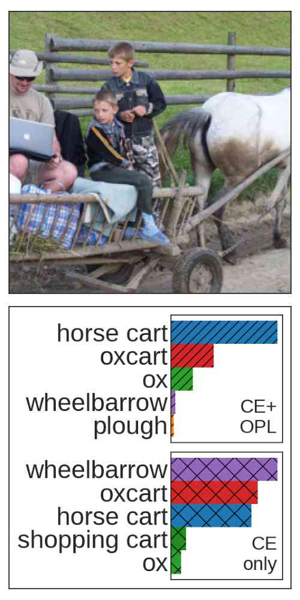
  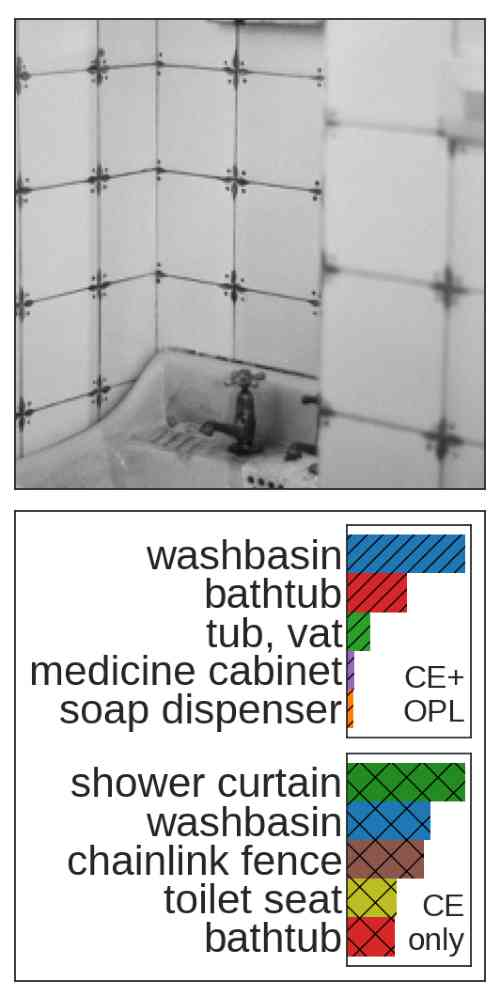
  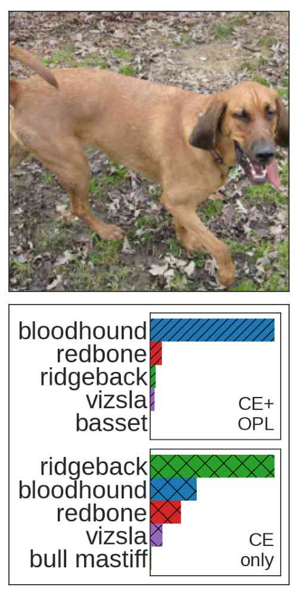
  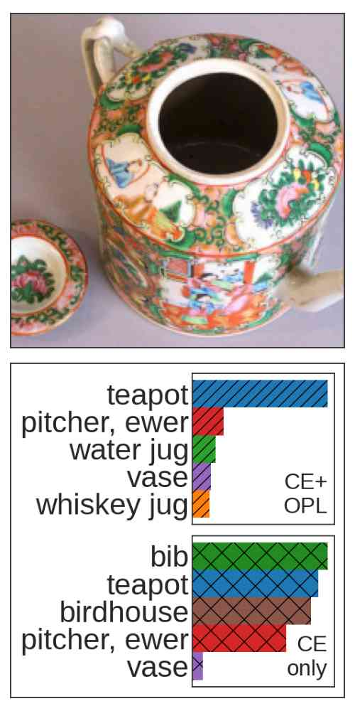
  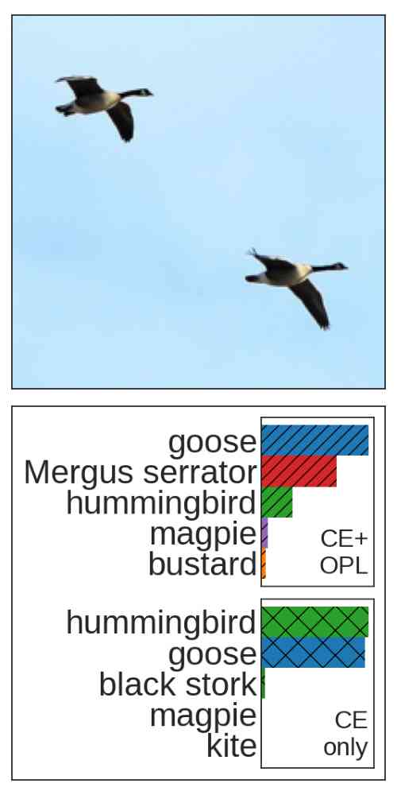
  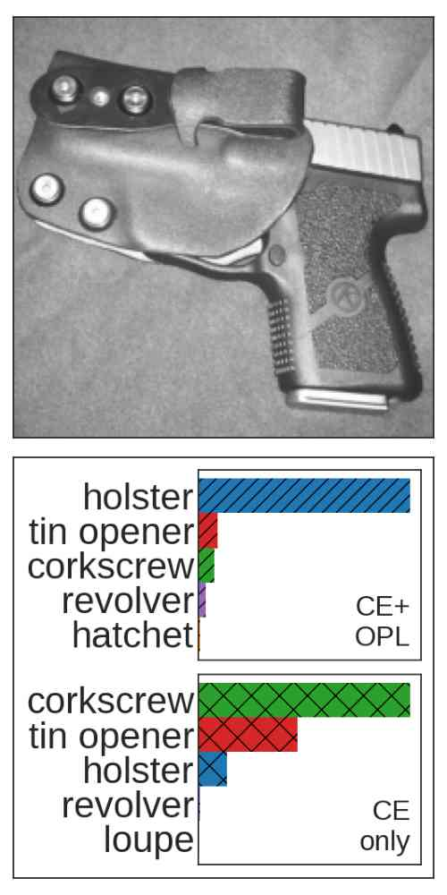
  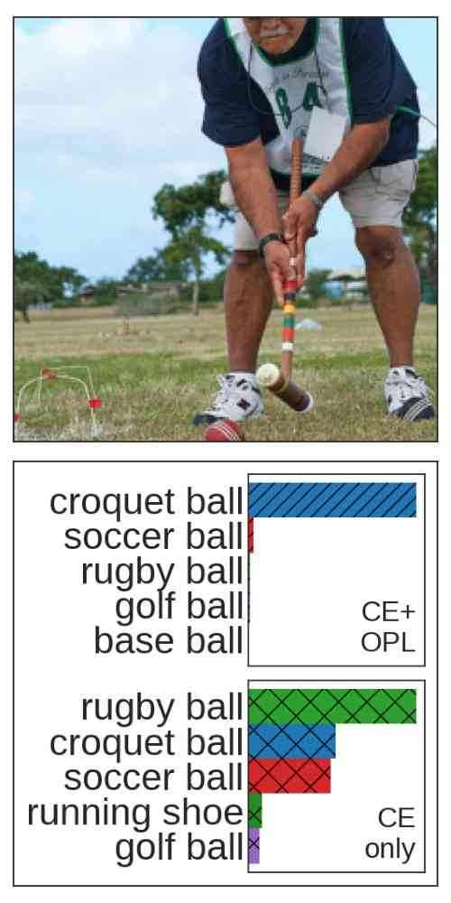
  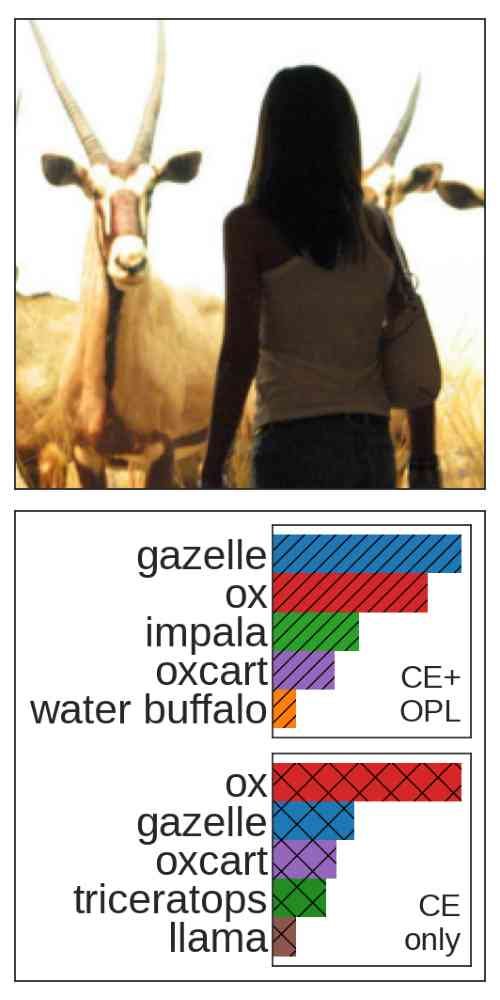
  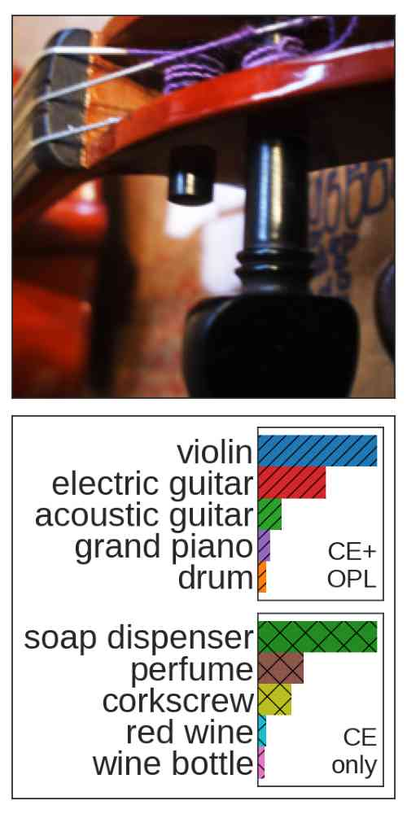
  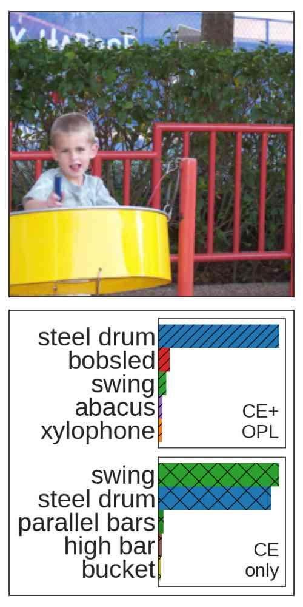
  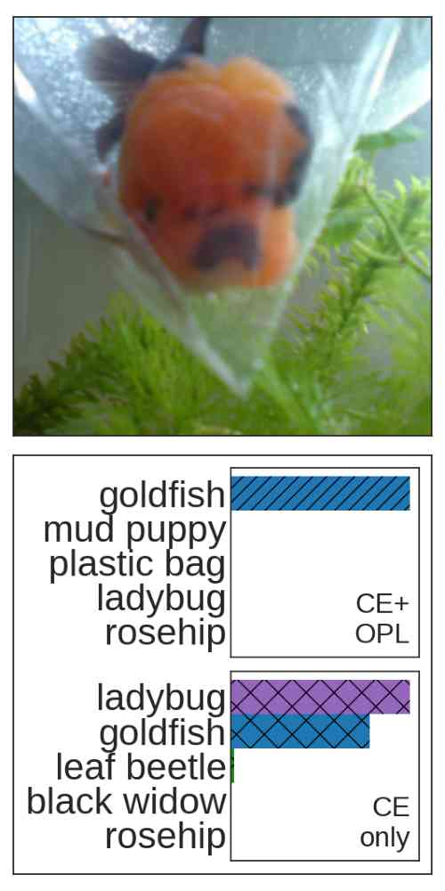
  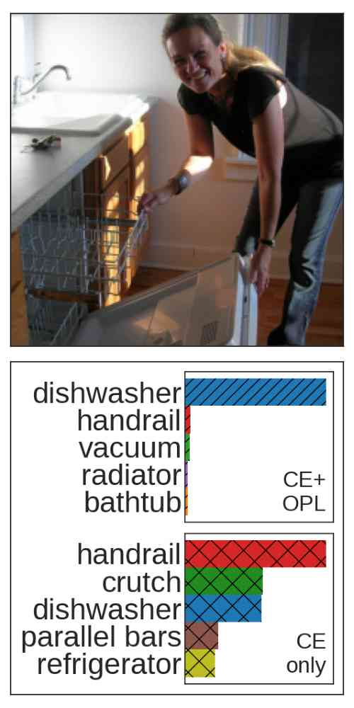
</p>

